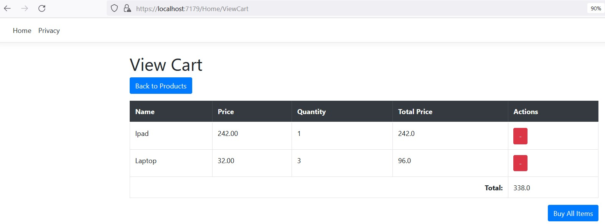

# Simple eCommerce Website

Welcome to our simple eCommerce website! This website is built using the Model-View-Controller (MVC) architecture, making it easy to manage and organize different aspects of the application. Below, we'll provide an overview of the website's structure, database setup, and instructions on how to get started.


# Introduction

Our simple eCommerce website is designed to showcase the basic functionalities of an online store. Users can browse through a list of products on the Home page and, if granted administrative privileges, manage (Create, Read, Update, Delete) products through the Admin page.
Features

Admin: Enables authorized users to perform CRUD operations on products (Create, Read, Update, Delete).


Home Page: Displays a list of available products for users to browse.


ViewCart Page: Displays a list of selected products




# Database Setup


Our website utilizes a database to store and manage product information. To set up the database, we use Entity Framework's migration system. Follow the steps below to migrate the database:

    Open the Package Manager Console:

    mathematica

Tools > NuGet Package Manager > Package Manager Console

Run the following command to scaffold the initial migration:

```

Add-Migration InitialCreate

```

Apply the migration to create the database:

```
    Update-Database
```
These commands will create the necessary tables and schema for the product data in the database.
Running the Application

To run the eCommerce website locally, follow these steps:

    Clone this repository to your local machine.

    Open the project in your preferred Integrated Development Environment (IDE) that supports .NET development.

    Build the solution to restore NuGet packages and compile the code.

    Set the startup project to the main web application.

    Run the application by pressing F5 or using the "Start Debugging" option.

    Access the website through your preferred web browser at: http://localhost:<port>/ (replace <port> with the port number shown in your IDE).

# API Usage

Our simple eCommerce website provides a RESTful API to retrieve product information based on their unique IDs. The API allows external applications to fetch product details for specific products. To use the API, follow the instructions below:
API Endpoint

The API endpoint for retrieving product details is:

```

GET /api/products/{id}

```
## Parameters

    id (required): The unique ID of the product you want to retrieve details for.

## Example

To retrieve the details of a specific product with ID 123, make a GET request to the following URL:

```

http://localhost:<port>/api/products/123

```

Replace <port> with the actual port number where the website is running.


## Response

The API will respond with JSON data containing the details of the requested product. The response will include the following information:

    Id: The unique ID of the product.
    Name: The name of the product.
    Price: The price of the product.

Here's an example of a JSON response for a product with ID 123:

```

{
  "Id": 123,
  "Name": "Product Name",
  "Price": 19.99
}
```

## How to Use the API

To use the API in your application, you can make HTTP GET requests to the API endpoint using your preferred programming language or tool. For example, in JavaScript, you can use the fetch API or libraries like axios to make requests to the API and handle the response data.

Below is an example of how to use the API in JavaScript:

```

const productId = 123;
const apiUrl = `http://localhost:<port>/api/products/${productId}`;

fetch(apiUrl)
  .then(response => response.json())
  .then(data => {
    // Handle the product data here
    console.log(data);
  })
  .catch(error => {
    // Handle any errors that occur during the request
    console.error('Error fetching product:', error);
  });

```
Remember to replace <port> with the actual port number where the website is running.

With this API, you can integrate our simple eCommerce website with your own applications or use it as a data source for other projects.

If you have any questions or need further assistance with the API, feel free to contact our support team. Happy coding!

Thank you for using our simple eCommerce website! We hope you find it useful and easy to navigate. Happy shopping!

# Contributing

We welcome contributions to improve and expand the functionality of our simple eCommerce website. If you'd like to contribute, please follow these steps:

    Fork the repository on GitHub.

    Create a new branch from the main branch for your changes.

    Make your changes and commit them to your branch.

    Push your branch to your forked repository.

    Open a pull request to the main branch of our repository, describing the changes you've made.

    We'll review your pull request and collaborate with you if any changes or improvements are needed.

# Support

If you encounter any issues or have questions regarding the website, please feel free to contact our support team. We're here to help and ensure a smooth experience for everyone using our eCommerce website.

Thank you for using our simple eCommerce website! We hope you find it useful and easy to navigate. Happy shopping!
